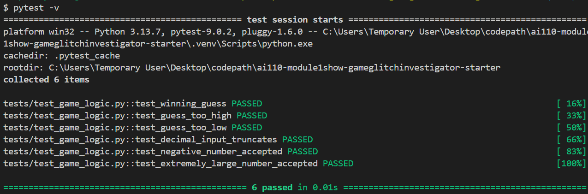
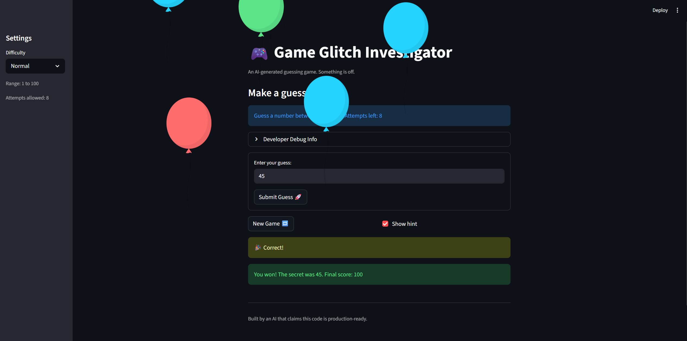

# 🎮 Game Glitch Investigator: The Impossible Guesser

## 🚨 The Situation

You asked an AI to build a simple "Number Guessing Game" using Streamlit.
It wrote the code, ran away, and now the game is unplayable. 

- You can't win.
- The hints lie to you.
- The secret number seems to have commitment issues.

## 🛠️ Setup

1. Install dependencies: `pip install -r requirements.txt`
2. Run the broken app: `python -m streamlit run app.py`

## 🕵️‍♂️ Your Mission

1. **Play the game.** Open the "Developer Debug Info" tab in the app to see the secret number. Try to win.
2. **Find the State Bug.** Why does the secret number change every time you click "Submit"? Ask ChatGPT: *"How do I keep a variable from resetting in Streamlit when I click a button?"*
3. **Fix the Logic.** The hints ("Higher/Lower") are wrong. Fix them.
4. **Refactor & Test.** - Move the logic into `logic_utils.py`.
   - Run `pytest` in your terminal.
   - Keep fixing until all tests pass!

## 📝 Document Your Experience

- [ ] Describe the game's purpose.
- [ ] Bugs & Fixes
1. Enter key not submitting the form
   - Wrapped the text input and submit button in `st.form()` and replaced `st.button` with `st.form_submit_button`. Streamlit forms intercept the Enter key and treat it as a form submission.
2. Hints were backwards
   - `check_guess` returned "Go HIGHER!" for "Too High" and "Go LOWER!" for "Too Low". Swapped the messages so they correctly guide the player.
3. Score calculation off by one
   - `attempts` was initialized to `1` instead of `0`, and the points formula used `attempt_number + 1`. A correct first guess scored 70 instead of 100. Fixed by initializing `attempts = 0` and changing the formula to `100 - 10 * (attempt_number - 1)`.
4. Score always -5/+5 alternating (Too High glitch)
   - `update_score` gave `+5` on even attempts for "Too High" guesses, causing the score to bounce instead of consistently decreasing. Fixed to always deduct 5 for any wrong guess.
5. New game not resetting all state
   - Clicking "New Game" only reset `attempts` and `secret`. Fixed to also reset `score`, `status`, and `history`.
6. Difficulty change not updating secret or info message
   - The secret was only generated once on first load. Switching difficulty kept the old secret and hardcoded "1 to 100" range. Fixed by tracking `difficulty_before` in session state and resetting all game state when difficulty changes, and replacing hardcoded range with `{low}` and `{high}`.
7. Invalid guesses consuming attempts
   - `attempts` was incremented before input was validated. Typing letters or submitting empty would waste an attempt. Fixed by moving the increment inside the `else` block after `parse_guess` succeeds.
8. Invalid guesses added to history
   - Invalid inputs were being appended to `st.session_state.history`. Removed that line so only valid guesses are tracked.
9. Info and debug panel showing stale state
   - `st.info` (attempts left) and the Developer Debug Info expander rendered before the submit block updated session state, showing values one rerun behind. Moved both before the `st.stop()` check and used `st.empty()` placeholders to keep them at the top of the page.
10. Even-attempt secret type bug
    - On even attempts, `st.session_state.secret` was cast to `str`, causing `guess == secret` (int vs str) to always fail. Removed the type conversion so the secret is always compared as an int.
- [ ] Refactor
   - Moved all logic functions to `logic_utils.py`
   The following functions were extracted from `app.py` into `logic_utils.py` and imported back:
      - `get_range_for_difficulty`
      - `parse_guess`
      - `check_guess`
      - `update_score`
   - Imports consolidated into a single line:
      ```python
      from logic_utils import check_guess, get_range_for_difficulty, parse_guess, update_score
      ```
- [ ] Test 
1. The Tuple Bug: I identified and fixed a bug where the code originally tried to store the output as `result = check_guess()`. Since the function returns a `tuple`, the outcome and the message, this caused errors. I corrected this to `result, _ = check_guess()` to properly unpack the values.
2. Win/Loss Logic: I verified that `check_guess(50, 50)` returns a `Win` and that guesses of 60 or 40 correctly trigger `Too High` and `Too Low` hints.
3. Decimal Handling: I tested how the app handles non-integers. The test showed that entering `1.9` is automatically truncated to `1` rather than being rejected, which is helpful for preventing crashes but might be confusing for the player.
4. Boundary Validation: I ran tests with an extreme value like `99999999` and a negative number like `-1`. These revealed that the `parse_guess` function accepts any integer, even if it is far outside the intended 1 to 100 game range.
   - Although I added a safeguard in `app.py` using `elif guess_int < low or guess_int > high:`, I realized this code cannot be reached by `pytest`.
   - To make the range check truly testable, the logic should be moved out of the UI and into a function like `validate_range(value, low, high)`. This would allow me to write automated tests that prove the safeguard works without needing to manually click through the app. However, for now, I kept the safeguard in `app.py` for simplicity in this small project.

## 📸 Demo

- [ ] 

## 🚀 Stretch Features

- [ ] [If you choose to complete Challenge 4, insert a screenshot of your Enhanced Game UI here]
